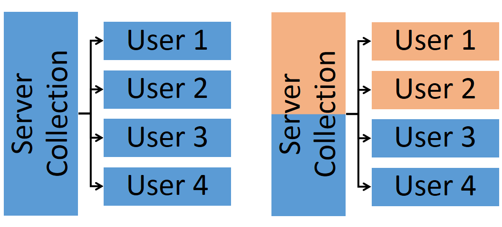

partitioner [](https://travis-ci.org/mizzao/meteor-partitioner)
===========

Transparently divide a single Meteor app into several different instances shared between different groups of users.

## What's this do?

Provides facilities to transparently separate your Meteor app into different instances where a group of users sees the data in each instance. You can write client-side and server-side code as if one particular set of users has the app all to themselves. This is illustrated in the following diagram:



On the left is a simple app where the same view of a particular collection is published to all users at once. However, we often have a situation where we want some users (1 and 2) to see a common view of the collection that is different from some other users (3 and 4). This pattern is common in settings where multiple users interact with each other in groups, such as multiplayer games, chat rooms, etc.

This package allows you to structure your code without thinking about how to separate data across the different groups. Both server and client side code automatically only affect the current group of a user unless directed otherwise.

## Installation

Install with Meteor:

```
meteor add mizzao:partitioner
```

## Usage

Partitioner uses the [collection-hooks](https://github.com/matb33/meteor-collection-hooks) package to transparently intercept collection operations on the client and server side so that writing code for each group of users is almost the same as writing for the whole app. Only minor modifications from a standalone app designed for a single group of users is necessary.

Partitioner operates at the collection level. On the server and client, call `Partition.partitionCollection` immediately after declaring a collection:

```
Foo = new Mongo.Collection("foo");
Partitioner.partitionCollection(Foo, options);
```

`options` determines how the partitioned collection will behave. The fields that are supported are

- `index`: an optional index argument that will be transformed and passed to `Collection._ensureIndex`; the default indexing behavior is to just index by group. This is useful if each partition will contain a lot of data and require efficient database lookups.

Collections that have been partitioned will behave as if there is a separate instance for each group. In particular, on the server and client, the user's current group is used to do the following:

- `find` and `findOne` operations will only return documents for the current group.
- `insert` will cause documents to appear only in the current group.
- `update` and `remove` operations will only affect documents for the current group.
- Attempting any operations on a partitioned collection for which a user has not been assigned to a group will result in an error.

This is accomplished using selector rewriting based on the current `userId` both on the client and in server methods, and Meteor's environment variables. For more details see the source.

## Common (Client/Server) API

#### `Partitioner.partitionCollection(Mongo.Collection, options)`

Adds hooks to a particular collection so that it supports partition operations. This should be declared immediately after `new Mongo.Collection` on both the server and the client.

**NOTE**: Any documents in the collection that were not created from a group will not be visible to any groups in the partition. You should think of creating a partitioned collection as an atomic operation consisting of declaring the collection and calling `partitionCollection`; we will consider rolling this into a single API call in the future.

#### `Partitioner.group()`

On the server and client, gets the group of the current user. Returns `undefined` if the user is not logged in or not part of a group. A reactive variable.

## Server API

#### `Partitioner.setUserGroup(userId, groupId)`

Adds a particular user to the group identified by `groupId`. The user will now be able to operate on partitioned collections and will only be able to affect documents scoped to the group. An error will be thrown if the user is already in a group.

#### `Partitioner.getUserGroup(userId)`

Gets the group of the current user.

#### `Partitioner.clearUserGroup(userId)`

Removes the current group assignment of the user. The user will no longer be able to operate on any partitioned collections.

#### `Partitioner.bindGroup(groupId, func)`

Run a function (presumably doing collection operations) masquerading as a particular group. This is necessary for server-originated code that isn't caused by one particular user.

#### `Partitioner.bindUserGroup(userId, func)`

A convenience function for running `Partitioner.bindGroup` as the group of a particular user.

#### `Partitioner.directOperation(func)`

Sometimes we need to do operations over the entire underlying collection, including all groups. This provides a way to do that, and will not throw an error if the current user method invocation context is not part of a group.

## Configuring Subscriptions

Suppose you have a publication on the server such as the following:

```js
Meteor.publish("fooPub", function(bar) {
  selector = doSomethingWith(bar);
  return Foo.find(bar);
});
```

On the client, you would subscribe to this with

```js
Meteor.subscribe("fooPub", bar);
```

Normally, all users would get the same view of the data as long as `bar` is the same. However, Partitioner will return a **different view of the data depending on the current group of the user**.

Note that due to a current limitation of Meteor (see below), this subscription will not update if the user's group changes on the server. Hence, you will need to update subscriptions to partitioned collections in a reactive computation:

```js
Deps.autorun(function() {
  var group = Partitioner.group();
  Meteor.subscribe("fooPub", bar, group);
});
```

**N.B.**: You need to pass `group` as a dummy last value to the subscription to ensure the publication is actually re-run on the server; otherwise, Meteor tries to be efficient by not actually re-subscribing if the arguments are the same.

## Partitioning of `Meteor.users`

`Meteor.users` is partitioned by default. Users will only see other users in their group in default publications. However, unscoped operations do not throw an error, because server operations (login, etc) need to proceed as normal when groups are not specified. This generally causes everything to work as expected, but please report any unexpected behavior that you see.

## Admin users

Partitioner treats users with `admin: true` as special. These users are able to see the entire contents of partitioned collections as well as all users when they are not assigned to a group, and operations will not result in errors.

However, when admin users join a group, they will only see the data and users in that group (if you set up the subscriptions as noted above.) They will also, currently, be unable to do **any** operations on partitioned collections. The idea is to allow admin users to be able to join games, chatrooms, etc for observational purposes, but to prevent them from making unintended edits from the user interface.

If you would like to see other ways to define admin permissions, please open an issue.

## Examples

### Before

Suppose you have a chat application with a `ChatMessages` collection, which is scoped by a field `room`. In vanilla Meteor, your publication might be written as follows:

```js
Meteor.publish("messages", function(roomId) {
  return ChatMessages.find({room: roomId});
});
```

Then, on the client, you might reactively subscribe to the chat room:

```js
Deps.autorun(function() {
  var roomId = Session.get("room");
  Meteor.subscribe("messages", roomId);
});
```

To send a message, a client or server method might do something like

```js
ChatMessages.insert({text: "hello world", room: currentRoom, timestamp: Date.now()});
```

This looks simple enough, until you realize that you need to keep track of the `room` for each message that is entered in to the collection. Why not have some code do it for you automagically?

### After

With this package, you can create a partition of the `ChatMessages` collection:

```js
ChatMessages = new Mongo.Collection("messages");
Partitioner.partitionCollection(ChatMessages, {index: {timestamp: 1}});
```

The second argument tells the partitioner that you want an index of `timestamp` within each group. Partitioned lookups using `timestamp` will be done efficiently. Then, you can just write your publication as follows:

```js
Meteor.publish("messages", function() {
  return ChatMessages.find();
});
```

The client's subscription would simply be the following:

```js
Deps.autorun(function() {
  var group = Partitioner.group();
  Meteor.subscribe("messages", group);
});
```

Now, sending a chat message is as easy as this:

```js
ChatMessages.insert({text: "hello world", timestamp: Date.now()});
```

To change chat rooms, simply have server code call `Partitioner.setUserGroup` for a particular user.

Note that the above code looks very similar to a Meteor app where there is only one chatroom, apart from the reactive subscription. This means you can think and reason about your data within each partition without worrying about accidentally touching things that you don't want. Chats, games, and other highly concurrent datasets can be designed for a single group of users, and quickly converted to multiple groups using this package.

### Other Examples

See [CrowdMapper](https://github.com/mizzao/CrowdMapper) for a highly concurrent mapping application that partitions several collections over groups of users.

## Limitations

- The admin role is currently fixed to users with `admin: true`, but this could certainly be extended with a custom rule.

- Users, not connections/sessions, are assigned to groups. If one user's connection joins a group, all connections will be part of that group. (This is another reason you must set up subscriptions reactively to make sure client data is sane.)

- Multiple partitions at once is not supported, i.e. `Foo` is partitioned one way and `Bar` is partitioned another way. There is only one set of groups over all users.

- Changing the group relies on a small amount of client-side code. It would be great if the publication would do a reactive join with something like [publish-with-relations](https://github.com/svasva/meteor-publish-with-relations), so that a single publication is controlled by the server and updated as the group changes. However, this would result in some potentially expensive observe operations, and can't be accomplished with transparent hooks - just to accomplish the same thing as a simple re-subscription. Hence, we've opted to use the latter for now.

## Notes

- For a discussion of how this was implemented see https://groups.google.com/forum/#!topic/meteor-talk/8u2LVk8si_s
- See also http://stackoverflow.com/q/17356615/586086
